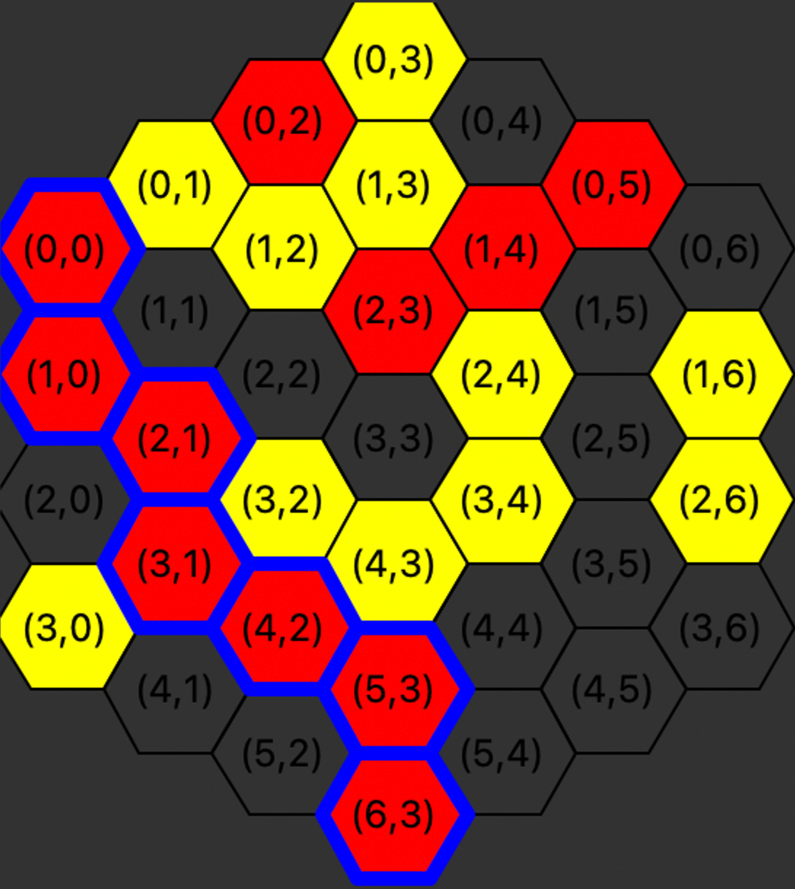

# Havannah-Playing-AI-Agent

An advanced AI agent for the board game Havannah, designed and implemented using Monte Carlo Tree Search (MCTS), UCB1, formation-aware heuristics, and a time-aware defensive module for intelligent threat blocking and strategy.

## Table of Contents

- [About Havannah](#about-havannah)
- [Features](#features)
- [Environment Setup](#environment-setup)
- [Usage](#usage)
  - [Playing the Game](#playing-the-game)
  - [Command-Line Options](#command-line-options)
  - [Game Logs](#game-logs)
- [Agents](#agents)
- [Game Rules & Mechanics](#game-rules--mechanics)
- [Code Structure](#code-structure)
- [Development Notes](#development-notes)
- [References](#references)
- [License](#license)

---

## About Havannah

**Havannah** is a two-player connection game played on a hexagonal grid. The objective is to form one of three possible winning structures: a Fork, a Bridge, or a Ring. Each player takes turns placing stones of their color on empty cells, aiming to achieve one of the win conditions before their opponent.

### Win Conditions

These are the three ways to win in Havannah:

#### 1. Fork 
Connect any three edges of the board with a continuous chain of your stones. A cell is considered part of an edge if it lies on the boundary of the board but is not a corner. 

<p align="center">
  <br>
  <em>Illustration: Yellow wins by connecting three edges (Fork).</em>
</p>


#### 2. Bridge
Connect any two of the six corners of the board with a continuous chain of your stones.
<p align="center">
  <br>
  <em>Illustration: Red wins by connecting two corners (Bridge).</em>
</p>

#### 3. Ring
Form a continuous loop (ring) that encloses at least one cell (empty or occupied by either player).
<p align="center">
  <br>
  <em>Illustration: Yellow wins by forming a closed loop around at least one cell (Ring).</em>
</p>

---

## Features

- Interactive GUI using Tkinter for real-time play.
- Supports Human vs. AI, AI vs. Random, AI vs. AI, or Human vs. Human matches.
- Flexible board size and initial state configuration.
- Strict enforcement of game rules (invalid moves, timeouts, etc.).
- Modular agent structure for extensibility.
- Custom heuristics for both offensive and defensive play, including immediate threat detection.
- **Automatic game logging**: Each game session generates a detailed log file for post-game analysis.

---

## Environment Setup

To ensure reproducibility and ease of use, I rely solely on Python, NumPy, and Tkinter.

1. **Install [conda](https://docs.conda.io/en/latest/miniconda.html)** if not already present.

2. **Create the environment:**  
   ```
   conda create -n <env_name> python=3.10 numpy tk
   ```
   This creates an isolated environment with the specified name with all dependencies.

3. **Activate the environment:**  
   ```
   conda activate <env_name>
   ```

4. **(Optional) Deactivate the environment:**  
   ```
   conda deactivate
   ```

---

## Usage

### Playing the Game

Ensure you are in the project directory and have activated the created environment.

#### 1. Game between two agents with a preset board
```bash
python3 game.py {agent_1} {agent_2} --start_file {test_case_path} --time {total_time_in_seconds}
```
- `agent_1`, `agent_2`: Options are `ai`, `human`, or `random`
- `--start_file`: Path to a board state file
- `--time`: Total game time (seconds) per player

#### 2. Game with a random initial board
```bash
python3 game.py {agent_1} {agent_2} --dim {dimension} --time {total_time_in_seconds}
```
- `--dim`: Board size (number of cells per edge)

#### 3. Human vs. AI
```bash
python3 game.py ai human --dim {dimension} --time {total_time_in_seconds}
```
- Play using mouse or by entering moves as `<row>,<col>` (0-indexed)

#### 4. AI vs. Random Agent
```bash
python3 game.py ai random --dim 5 --time 20
```

#### 5. AI vs. AI on a preset board
```bash
python3 game.py ai ai --start_file havannah/initial_states/size4.txt --time 20
```

### Command-Line Options

- `--dim {dimension}`: Board size (cells per edge)
- `--start_file {file}`: File with the initial board state
- `--time {seconds}`: Total time for each player
- Agents: `ai`, `human`, or `random`

---

### Game Logs

For every game session, the program automatically creates a `logs.txt` file in the project directory. This log records the entire game for later analysis and debugging. 

**The log file includes:**
- Board size and initial configuration
- Player types (e.g., human, ai)
- Sequence of moves (including which player made each move, in row/col format)
- Any invalid moves attempted
- Game outcome (winner, structure formed, winning path)
- Time remaining for each player at game end

**Sample `logs.txt` excerpt:**
```
5
0 0 0 0 0 0 0 0 0 
0 0 0 0 0 0 0 0 0 
0 0 0 0 0 0 0 0 0 
0 0 0 0 0 0 0 0 0 
0 0 0 0 0 0 0 0 0 
3 0 0 0 0 0 0 0 3 
3 3 0 0 0 0 0 3 3 
3 3 3 0 0 0 3 3 3 
3 3 3 3 0 3 3 3 3 
Player 1 Type: human
Player 2 Type: ai
{"player": 1, "move": [0, 8]}
{"player": 2, "move": [8, 4]}
{"player": 1, "move": [1, 8]}
{"player": 2, "move": [1, 7]}
...
{"player": 1, "move": "(1, 3) is invalid"}
...
Game Over
Winner: Player 2
Structure Formed: bridge
Winning Path: [(0, 4), (0, 0), (0, 1), (0, 2), (0, 3)]
Player 1 Time Remaining: 107.46 s
Player 2 Time Remaining: 112.80 s
```
This logging feature helps in reviewing game play, troubleshooting agent decisions, and validating outcomes.

---

## Agents

- **ai**: My main AI agent (MCTS + UCB1 + custom heuristics + time awareness)
- **random**: Uniformly random legal moves
- **human**: User-controlled moves via GUI or command line

---

## Game Rules & Mechanics

- **Invalid moves:** Playing on a blocked or out-of-bounds cell skips the move and passes the turn.
- **Timeouts:** If a player runs out of time, they forfeit the game.
- **Win conditions:** As described above (Fork, Bridge, Ring).
- **Human interaction:** Enter moves as `<row>,<col>` or via mouse click.

---

## Code Structure

- `game.py`: Launcher and main loop with GUI and argument parsing
- `Players/`: My agent implementations (AI, random, etc.)
- `helper.py/`: Board logic, rules, and utility functions
- `Boards/`: Example board files
- `Images/`: Game and win-condition diagrams
- `README.md`: Project documentation

---

## Development Notes

- I intentionally restricted dependencies to `numpy` and `tk` for maximum portability and reproducibility.
- The agent’s design is modular to facilitate experimentation with heuristics and search strategies.
- All rules and logic were implemented to match official Havannah standards.

---

## References

- [Havannah (Wikipedia)](https://en.wikipedia.org/wiki/Havannah)
- [Monte Carlo Tree Search](https://en.wikipedia.org/wiki/Monte_Carlo_tree_search)
- [UCB1 Algorithm](https://en.wikipedia.org/wiki/Multi-armed_bandit#The_UCB1_algorithm)

---

## License

This project is released for educational and research purposes.  
See [LICENSE](./LICENSE) if included.
